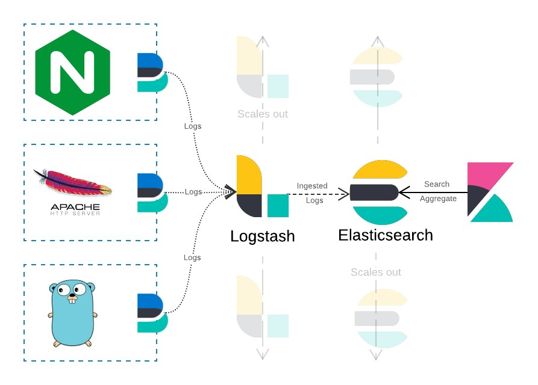
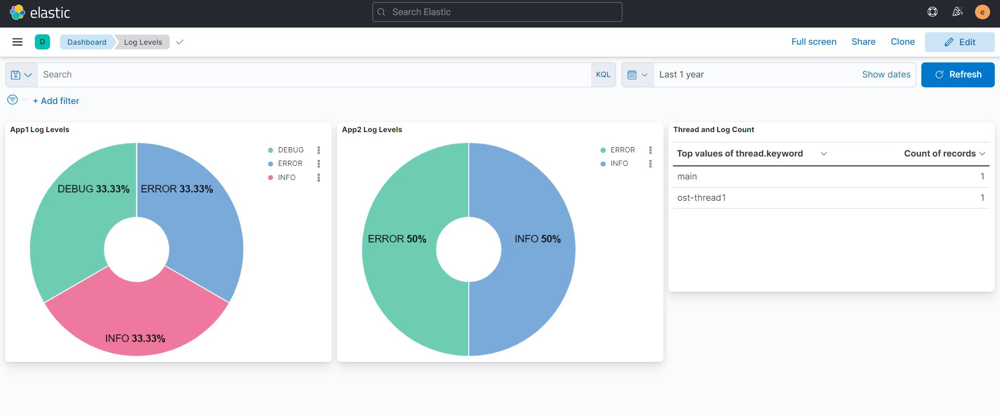
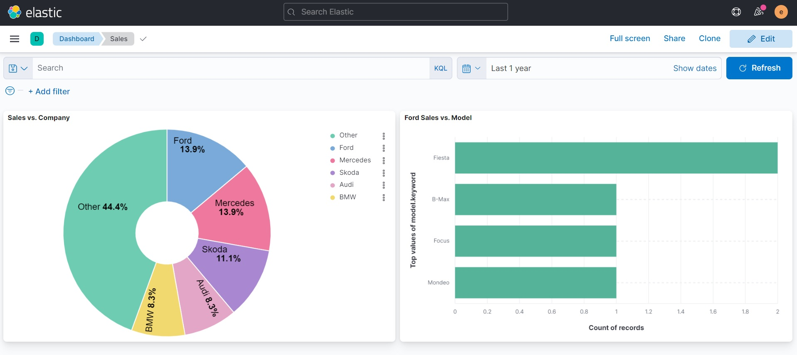

# Elasticsearch + Logstash + Kibana
This is a sample project to demonstrate the usage of Elasticsearch, Logstash and Kibana.

###### E = Elasticsearch
Elasticsearch is a distributed search and analytics engine built on Apache Lucene. Support for various languages, high performance, and schema-free JSON documents makes Elasticsearch an ideal choice for various log analytics and search use cases.
###### L = Logstash
Logstash is an open-source data ingestion tool that allows you to collect data from a variety of sources, transform it, and send it to your desired destination. With pre-built filters and support for over 200 plugins, Logstash allows users to easily ingest data regardless of the data source or type.
###### K = Kibana
Kibana is a data visualization and exploration tool for reviewing logs and events. Kibana offers easy-to-use, interactive charts, pre-built aggregations and filters, and geospatial support and making it the preferred choice for visualizing data stored in Elasticsearch.
## Run Locally
To start the Docker containers, run the following command on docker-compose.yml
```bash
docker-compose -f "docker-compose.yml" up -d --build
```
While running a multi-node cluster for Elasticsearch we might see the below issue in the logs.

```max virtual memory areas vm.max_map_count [65530] is too low, increase to at least [262144]```

To fix this issue, run the commands mentioned [here](https://www.elastic.co/guide/en/elasticsearch/reference/current/vm-max-map-count.html)

## Services

- Elasticsearch [http://localhost:9200](http://localhost:9200/)
- Kibana (Dashboard) [http://localhost:5601](http://localhost:5601/)

## Use Cases
#### 1. Logging messages from Kafka


Once the Kafka container is running successfully, attach a bash shell to the container and run the following commands to send messages on the topics **student** and **employee**.
```bash
kafka-console-producer --broker-list localhost:9092 --topic student
> {"name":"John","marks":54}
kafka-console-producer --broker-list localhost:9092 --topic employee
> {"dept":"IT","emp":"Max"}
```
Now login to Kibana and navigate through menu **Management** > **Stack Management** > **Index patterns** > **Create index pattern**
Create an index pattern as **data*** and navigate to Discover tab and search on this index.

We will be able to search messages from Kafka topics as Logstash has ingested the messages to two new indices i.e. **data.student** and **data.employee**.

#### 2. Centralized logging


Once the Filebeat(B) container runs successfully, it will deploy logging agents for shipping logs from the provided input paths in the YAML file and outputs the data to Logstash. Data is then forwarded to Elasticsearch and two indices are created **app1-log** and **app2-log** for storing logs from both the app1 and app2.

Now we can create two index patterns *app1* and *app2* with the timestamp filter to view our logs in the *Discover* tab.

#### 3. Visualization from CSV data
Logstash can watch a data source such as a *CSV* file, process incoming data, and output it into specified sources as indices. Once started, it usually stays on and watches for any changes in the data source in realtime. We can setup a pipeline to ingest this data and use it to create visual dashboards as given below.

#### Dashboard
Using the data collected from logs and indices created above we can visualize and analyze our logs. To create a similar dashboard as shown below follow these steps.

**Dashboard** > **Create dashboard** > **Create visualization** > Drag and drop one field from the selected index > Select visualization type > **Save and return** 

Now the visualization would automatically appear on the dashboard, we just modify the labels and size according to our requirements and your dashboard is ready!

**1. App Logs Dashboard**


**2. Sales Dashboard (using data from CSV)**
