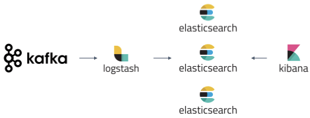

# Elasticsearch + Logstash + Kibana
This is a sample project to demonstrate the usage of Elasticsearch, Logstash and Kibana.

###### E = Elasticsearch
Elasticsearch is a distributed search and analytics engine built on Apache Lucene. Support for various languages, high performance, and schema-free JSON documents makes Elasticsearch an ideal choice for various log analytics and search use cases.
###### L = Logstash
Logstash is an open-source data ingestion tool that allows you to collect data from a variety of sources, transform it, and send it to your desired destination. With pre-built filters and support for over 200 plugins, Logstash allows users to easily ingest data regardless of the data source or type.
###### K = Kibana
Kibana is a data visualization and exploration tool for reviewing logs and events. Kibana offers easy-to-use, interactive charts, pre-built aggregations and filters, and geospatial support and making it the preferred choice for visualizing data stored in Elasticsearch.
## Run Locally
To start the Docker containers, run the following command on docker-compose.yml
```bash
docker-compose -f "docker-compose.yml" up -d --build
```
While running a multi-node cluster for Elasticsearch we might see the below issue in the logs.
```max virtual memory areas vm.max_map_count [65530] is too low, increase to at least [262144]```

To fix this issue, run the commands mentioned [here](https://www.elastic.co/guide/en/elasticsearch/reference/current/vm-max-map-count.html)

## Services

- Elasticsearch [http://localhost:9200](http://localhost:9200/)
- Kibana (Dashboard) [http://localhost:5601](http://localhost:5601/)

## Use Cases
#### 1. Log messages from Kafka

Once the Kafka container is running successfully, attach a bash shell to the container and run the following commands to send messages on the topics **student** and **employee**.
```bash
kafka-console-producer --broker-list localhost:9092 --topic student
> {"name":"John","marks":54}
kafka-console-producer --broker-list localhost:9092 --topic employee
> {"dept":"IT","emp":"Max"}
```
Now login to Kibana and navigate through menu **Management** > **Stack Management** > **Index patterns** > **Create index pattern**
Create an index pattern as **data*** and navigate to Discover tab and search on this index.

We will be able to search messages from Kafka topics as Logstash has ingested the messages to two new indices i.e. **data.student** and **data.employee**.