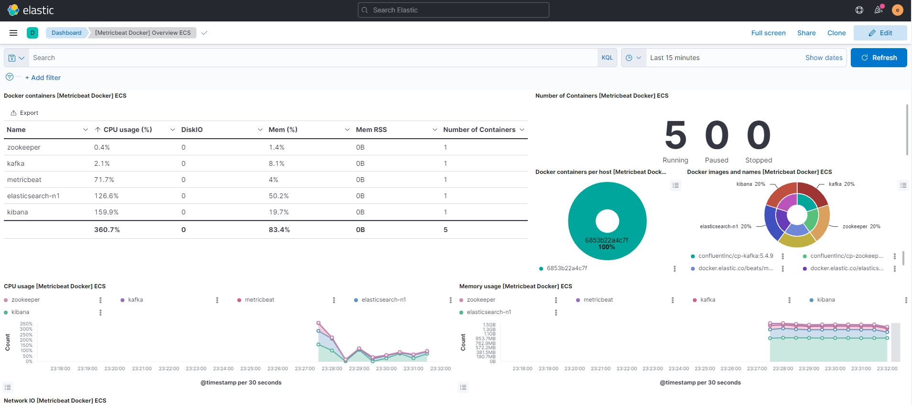

# ELK + Metricbeat = Monitoring
Metricbeat is a lightweight shipper that you can install on your servers to periodically collect metrics from the operating system and from services running on the server. Metricbeat takes the metrics and statistics that it collects and ships them to the output that you specify, such as Elasticsearch, Logstash, Redis, or Kafka.

Metricbeat helps you monitor your servers by collecting metrics from the system and services running on the server, such as:
- Apache
- HAProxy
- MongoDB
- MySQL
- Nginx
- PostgreSQL
- Redis
- System
- Zookeeper

## Run locally
To start the Docker containers, run the following command on docker-compose.yml
1. First we need to start all the other containers, mainly Kibana since Metricbeat needs it to be running before it starts and tries to connect.
```bash
docker compose  -f "elk-monitoring\docker-compose.yml" up -d --build elasticsearch-n1 kafka kibana zookeeper
```

2. Once Kibana is up and running we can go ahead and start the Metricbeat container.
```bash
docker compose  -f "elk-monitoring\docker-compose.yml" up -d --build metricbeat
```

Metricbeat comes packaged with example Kibana dashboards, visualizations, and searches for visualizing Metricbeat data in Kibana. Before you can use the dashboards, you need to create the index pattern, **metricbeat-***, and load the dashboards into Kibana.

The following config in the *metricbeat.yml* enables these sample dashboards.
```
setup.dashboards:
  enabled: true
```

## Dashboards
#### 1. System Dashboard
Deploy Metricbeat on your Linux, Windows, and Mac hosts, connect it to Elasticsearch and you get system-level CPU usage, memory, file system, disk IO, and network IO statistics, as well as top-like statistics for every process running on your systems.


#### 2. Docker Dashboard
Docker module fetches metrics from Docker containers. The default metricsets are: container, cpu, diskio, healthcheck, info, memory and network. The image metricset is not enabled by default.


#### 3. Kafka Dashboard
The default metricsets are consumergroup and partition. The Broker, Producer, Consumer metricsets require Jolokia to fetch JMX metrics. Refer to those Metricsets' documentation about how to use Jolokia.
Test using the following commands to:
1. Creates topic and publish message
```bash
kafka-console-producer --broker-list localhost:9092 --topic test
> msg1
> msg2
> msg3
```
2. Create consumer and read messages on above topic
```bash
kafka-console-consumer --topic test --from-beginning --bootstrap-server localhost:9092
msg1
msg2
msg3
```

