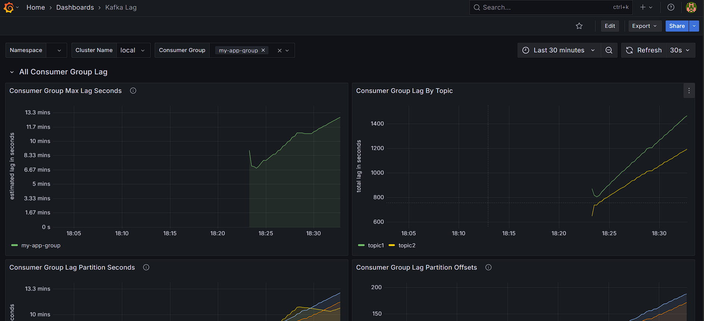

# Kafka Lag Monitoring

## 📌 Overview

This project sets up a complete Kafka monitoring stack using Docker Compose. It includes:

* **Apache Kafka** in KRaft mode (no Zookeeper)
* **Kafka UI** for topic and message inspection
* **Kafka Lag Exporter** to expose consumer group lag metrics
* **Prometheus** for metrics scraping
* **Grafana** for visualization
* **Go applications** that produces and consumes messages from two topics, introducing artificial lag for monitoring purposes

## 🚀 Getting Started

### Prerequisites

* [Docker](https://www.docker.com/get-started)
* [Docker Compose](https://docs.docker.com/compose/install/)
* [Go](https://golang.org/dl/) (for running the Go application)

### Start the Services

```bash
docker compose up -d
```

### Run the Go Application

```bash
cd kafka-lag-monitoring/producer1
go run main.go

cd kafka-lag-monitoring/producer2
go run main.go
```

The Go applications will start producing and consuming messages from two topics (`topic1` and `topic2`), introducing a delay in consumption to simulate lag.

## 🔧 Configuration

### Kafka Lag Exporter (`kafka-lag-exporter.conf`)

```hocon
kafka-lag-exporter {
  clusters = [
    {
      name = "local"
      bootstrap-brokers = "kafka:9094"
    }
  ]
  poll-interval = 15s
}
```

This configuration sets up the Kafka Lag Exporter to connect to the Kafka broker and expose metrics on port 8000.

### Prometheus (`prometheus.yml`)

```yaml
global:
  scrape_interval: 15s

scrape_configs:
  - job_name: 'kafka-lag-exporter'
    static_configs:
      - targets: ['kafka-lag-exporter:8000']
```

Prometheus is configured to scrape metrics from the Kafka Lag Exporter.

### Grafana

Grafana is set up with provisioning to automatically load dashboards and data sources. You can access it at `http://localhost:3000`.

## 📊 Accessing the Dashboards

* **Kafka UI**: [http://localhost:8080](http://localhost:8080)
* **Prometheus**: [http://localhost:9090](http://localhost:9090)
* **Grafana**: [http://localhost:3000](http://localhost:3000)

  * Default credentials: `admin` / `admin`

In Grafana, you can import the **kafka-lags-dashboard.json** for visualizing consumer group lags.


## 🧹 Cleanup

To stop and remove all containers:

```bash
docker compose down
```

## 📄 License

This project is licensed under the MIT License.