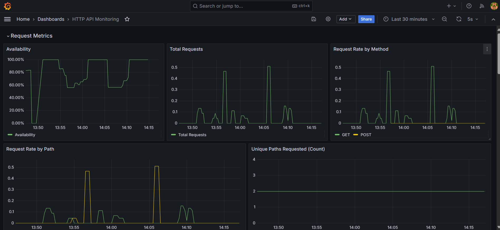

# HTTP API Monitoring Dashboard

This Grafana dashboard monitors HTTP REST APIs using Prometheus metrics, providing insights into request rates, response times, errors, and status codes.

## Features

- Request rates and unique paths
- Error counts and rates (4xx, 5xx)
- Response time metrics (average, percentiles, heatmap)
- Status code distributions

## Prerequisites

- Grafana 7.0+
- Prometheus with `http_requests_total` and `http_request_duration_seconds` metrics

## Setup

1. Import the dashboard JSON into Grafana.
2. Link it to your Prometheus data source.
3. Ensure metrics have `path`, `method`, and `status` labels.

## Usage

- Explore sections: Requests, Errors, Response Times, Status Codes.
- Adjust time ranges and interact with panels for details.

## Screenshots
